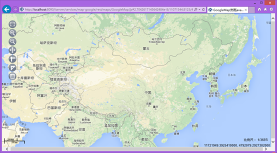
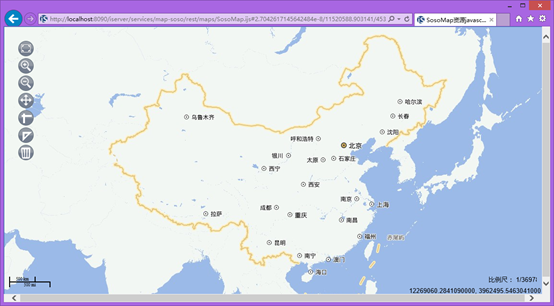
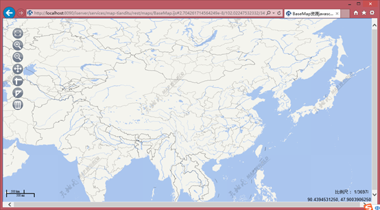
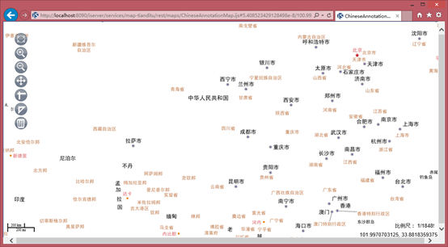
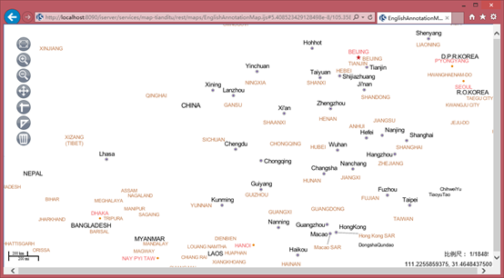

### 一、简介

基于iServer，提供聚合各类在线瓦片地图服务的示例。如谷歌地图、搜搜地图、天地图等。

### 二、扩展开发

示例都是基于[ProviderBase](https://github.com/yjjqrqqq/iServer_RemoteTileProviders/blob/master/remotetileproviders/ProviderBase.java) 抽象类实现的。需要指定一组瓦片地图参数，具体参数说明如下：
需要实现remoteTileMapParameters()方法，用户需要提供第三方在线地图的地图参数，包括以下几个：

<table cellspacing="0px" align="center">
	<col style="width: 15%;">
	<col style="width: 15%;">
	<col style="width: 15%;">
	<col style="width: 55%;">
	<tr>
		<td><b>名称</b></td>
		<td><b>类型</b></td>
		<td><b>含义</b></td>
		<td><b>是否必要</b></td>
	</tr>
	<tr>
		<td>mapName</td>
		<td>String</td>
		<td>地图名。</td>
		<td>是</td>
	</tr>
	<tr>
		<td>origin</td>
		<td>Point2D</td>
		<td>切片原点。</td>
		<td>是</td>
	</tr>
	<tr>
		<td>bounds</td>
		<td>Rectangle2D</td>
		<td>全图范围。</td>
		<td>是</td>
	</tr>
	<tr>
		<td>prjCoordSys</td>
		<td>PrjCoordSys</td>
		<td>地图投影。</td>
		<td>是</td>
	</tr>
	<tr>
		<td>scales</td>
		<td>double[]</td>
		<td>地图比例尺集合。</td>
		<td>否</td>
	</tr>
	<tr>
		<td>resolutions</td>
		<td>double[]</td>
		<td>地图分辨率集合。</td>
		<td>否</td>
	</tr>
	<tr>
		<td>remoteTileUrl</td>
		<td>RemoteTileUrl</td>
		<td>提供构造请求瓦片的URL的方法。</td>
		<td>是</td>
	</tr>
</table>

注意：
 1.其中分辨率集合和比例尺集合，至少设置一个，但建议都设置。 
 2.SuperMap默认瓦片轴方向为右下。如果在线地图的瓦片轴方向和supermap的不同的话,那么瓦片行列号可能涉及到转换。详情请参见[部分瓦片地图服务参数介绍](https://github.com/SuperMap/iServer_RemoteTileProviders/blob/master/%E9%83%A8%E5%88%86%E7%93%A6%E7%89%87%E5%9C%B0%E5%9B%BE%E6%9C%8D%E5%8A%A1%E5%8F%82%E6%95%B0%E4%BB%8B%E7%BB%8D.docx) 和扩展示例。 

### 三、配置部署

详见[配置和部署](https://github.com/SuperMap/iServer_RemoteTileProviders/blob/master/%E9%85%8D%E7%BD%AE%E5%92%8C%E9%83%A8%E7%BD%B2.docx) 。

### 四、扩展示例

这里提供了三个示例：

1.[谷歌瓦片地图服务示例](https://github.com/SuperMap/iServer_RemoteTileProviders/blob/master/remotetileproviders/GoogleMapsMapProvider.java)

2.[搜搜瓦片地图服务示例](https://github.com/SuperMap/iServer_RemoteTileProviders/blob/master/remotetileproviders/SosoMapProvider.java)

3.[天地图瓦片地图服务示例](https://github.com/SuperMap/iServer_RemoteTileProviders/blob/master/remotetileproviders/TiandituMapProvider.java)

### 五、在Eclipse中使用工程

1.导入Java项目：File→Import→选择General下的Existing Projects into Workspace→选择项目文件夹→Finish完成导入。
 
2.添加项目依赖的jar包：在项目名称点击右键→Build Path→Configure Build Path→在Order and Export选项下勾选JRE System Library→在Libraries选项下点击Add External JARs按钮选择%SuperMapiServer_HOME%/webapps/iserver/WEB-INF/lib/下的所有jar包。

