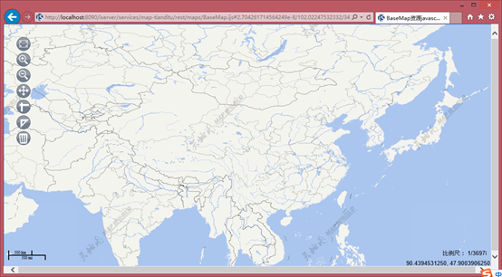

### I. Introduction

Based on iServer, provides an example of aggregating various online tile map services. Such as Google Maps, Soso Maps, Sky Maps, etc.

### Second, expand development

The examples are all based on the abstract class [ProviderBase]
(https://github.com/yjjqrqqq/iServer_RemoteTileProviders/blob/master/remotetileproviders/ProviderBase.java). 
You need to specify a set of tile map parameters. The specific parameters are described as follows:

<table cellspacing="0px" align="center">
	<col style="width: 15%;">
	<col style="width: 15%;">
	<col style="width: 15%;">
	<col style="width: 55%;">
	<tr>
		<td><b>Name</b></td>
		<td><b>Type</b></td>
		<td><b>meaning</b></td>
		<td><b>Necessary</b></td>
	</tr>
	<tr>
		<td>mapName</td>
		<td>String</td>
		<td>Map name</td>
		<td>Yes</td>
	</tr>
	<tr>
		<td>origin</td>
		<td>Point2D</td>
		<td>Slice origin</td>
		<td>Yes</td>
	</tr>
	<tr>
		<td>bounds</td>
		<td>Rectangle2D</td>
		<td>Full graph range</td>
		<td>Yes</td>
	</tr>
	<tr>
		<td>prjCoordSys</td>
		<td>PrjCoordSys</td>
		<td>Map projection</td>
		<td>Yes</td>
	</tr>
	<tr>
		<td>scales</td>
		<td>double[]</td>
		<td>Map scale collection</td>
		<td>No</td>
	</tr>
	<tr>
		<td>resolutions</td>
		<td>double[]</td>
		<td>Map resolution set</td>
		<td>No</td>
	</tr>
	<tr>
		<td>remoteTileUrl</td>
		<td>RemoteTileUrl</td>
		<td>Provides a method to construct the URL of the request tile</td>
		<td>Yes</td>
	</tr>
</table>

note：
 1.Which resolution set and scale set, set at least one, but it is recommended to set. 
 2. SuperMap default tile axis direction is the lower right. If the orientation of the tile axis of the online map is different from that of the supermap, then the tile row number may involve conversion. For details, please refer to [Partial tile map service parameter introduction] (https://github.com/SuperMap/iServer_RemoteTileProviders/blob/master/%E9%83%A8%E5%88%86%E7%93%A6%E7% 89%87%E5%9C%B0%E5%9B%BE%E6%9C%8D%E5%8A%A5%8F%82%E6%95%B0%E4%BB%8B%E7%BB% 8D.docx) and extension examples.  

### Third, the configuration and deployment

For details, see [Configuration and Deployment] (https://github.com/SuperMap/iServer_RemoteTileProviders/blob/master/%E9%85%8D%E7%BD%AE%E5%92%8C%E9%83%A8%E7 %BD%B2.docx) .
### IV. Licensing
See "LICENSE.txt" for details.

### V. Extension Example

1.[Google Map](https://github.com/SuperMap/iServer_RemoteTileProviders/blob/master/src/remotetileproviders/GoogleMapsMapProvider.java) 

2.[Search map](https://github.com/SuperMap/iServer_RemoteTileProviders/blob/master/src/remotetileproviders/SosoMapProvider.java)  

3.[Day map](https://github.com/SuperMap/iServer_RemoteTileProviders/blob/master/src/remotetileproviders/TiandituMapProvider.java) 

 注：Note: SuperMap iServer has a built-in sky map provider. The example is mainly to illustrate how to extend the online map service of WGS84 projection.

### 6. Import as an Eclipse project

1.Import the Java project: File→Import→Select Existing Projects into Workspace under General→Select project folder→Finish to complete the import.  
2. Add the project dependent jar package: Right-click on the project name → Build Path → Configure Build Path → Check the JRE System Library under Order and Export → Click the Add External JARs button under the Libraries tab. Select %SuperMapiServer_HOME%/webapps/ All jars under iserver/WEB-INF/lib/.
